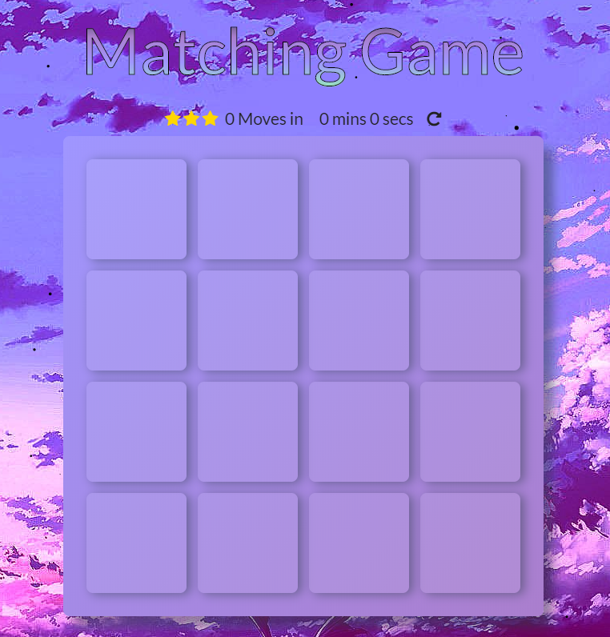
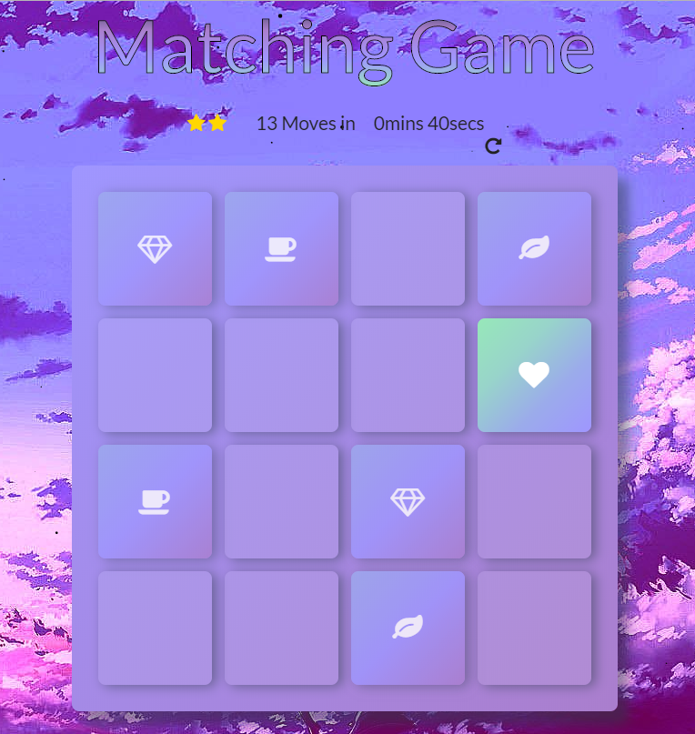

# Matching Game

### This Project is for [FEND Udacity](https://udacity.com/course/front-end-web-developer-nanodegree--nd001/ "Font-End Web Developer Nanodegree") ♥

## Instructions 
### How to play

* Start game by clicking on any card
* Find its pair by using your memory
* Keep going until all cards are paired to win the game
* The goal is to pair cards with least amount of moves and time required

## Implementation
### About code
* Declared cards array that will hold all the cards upon start and restart
* Used provided shuffle function to shuffle cards array
* Compared revealed card types to decide whether they are succesfully paired or not
* Created Congratulation pop-up displaying all moves, time spent and star rating that appears when all cards are paired together

### Packages and Dependencies

* Shuffle function from (http://stackoverflow.com/a/2450976) provided by Udacity
* Floating background particles by [Marc Bruederlin](hello@marcbruederlin.com) from (https://github.com/marcbruederlin/particles.js)